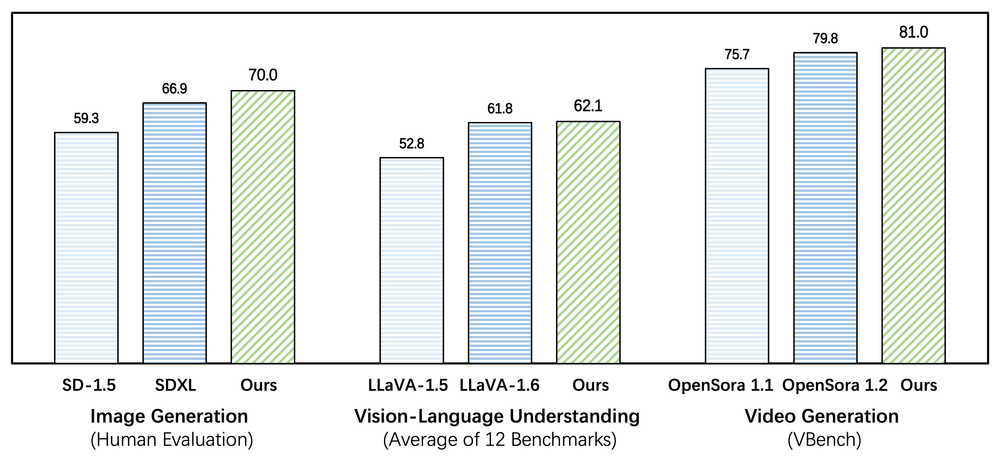

<div align='center'>
<h1>Emu3: Next-Token Prediction is All You Need</h1h1>
<h3></h3>

[Emu3 Team, BAAI](https://www.baai.ac.cn/english.html)

| [Project Page](https://emu.baai.ac.cn) | [Paper](https://arxiv.org/pdf/2409.18869) | [🤗HF Models](https://huggingface.co/collections/BAAI/emu3-66f4e64f70850ff358a2e60f) | [Modelscope](https://modelscope.cn/collections/Emu3-9eacc8668b1043) | [Demo](https://huggingface.co/spaces/BAAI/Emu3) |


</div>

<div align='center'>

</div>

We introduce **Emu3**, a new suite of state-of-the-art multimodal models trained solely with **<i>next-token prediction</i>**! By tokenizing images, text, and videos into a discrete space, we train a single transformer from scratch on a mixture of multimodal sequences.

### Emu3 excels in both generation and perception
**Emu3** outperforms several well-established task-specific models in both generation and perception tasks, surpassing flagship open models such as SDXL, LLaVA-1.6 and OpenSora-1.2, while eliminating the need for diffusion or compositional architectures.

<div align='center'>

</div>

### Highlights

- **Emu3** is capable of generating high-quality images following the text input, by simply predicting the next vision token. The model naturally supports flexible resolutions and styles.
- **Emu3** shows strong vision-language understanding capabilities to see the physical world and provides coherent text responses. Notably, this capability is achieved without depending on a CLIP and a pretrained LLM.
- **Emu3** simply generates a video causally by predicting the next token in a video sequence, unlike the video diffusion model as in Sora. With a video in context, Emu3 can also naturally extend the video and predict what will happen next. 

## News
- 2024.10 We release the image pretrained model **[Emu3-Stage1](https://huggingface.co/BAAI/Emu3-Stage1)** and the sft scripts. The model supports image captioning and can generate images at a resolution of 512x512. You can use our training scripts for further instruction tuning for more image generation and perception tasks. 🔥🔥🔥
- 2024.09 We relase **[Emu3-Chat](https://huggingface.co/BAAI/Emu3-Chat)** and **[Emu3-Gen](https://huggingface.co/BAAI/Emu3-Gen)** which are post training models separately for vision-language understanding and vision generation.
- 2024.09 We introduce Emu3, a new suite of state-of-the-art multimodal models trained solely with next-token prediction.


### TODO

- [X] Release model weights of tokenizer, Emu3-Chat and Emu3-Gen
- [X] Release the inference code.
- [ ] Release the evaluation code.
- [X] Release training scripts for sft.
- [ ] Release training scripts for pretrain and dpo.


### Setup

Clone this repository and install required packages:

```shell
git clone https://github.com/baaivision/Emu3
cd Emu3

pip install -r requirements.txt
```

### Model Weights

| Model name               | HF Weight                                                      | Modelscope                                                                | Wisemodel                                                               |
| ------------------------ | -------------------------------------------------------------- | ------------------------------------------------------------------------- | ----------------------------------------------------------------------- |
| **Emu3-Stage1**          | [🤗 HF link](https://huggingface.co/BAAI/Emu3-Stage1)          | [Modelscope link](https://modelscope.cn/models/BAAI/Emu3-Stage1)          |  |
| **Emu3-Chat**            | [🤗 HF link](https://huggingface.co/BAAI/Emu3-Chat)            | [Modelscope link](https://modelscope.cn/models/BAAI/Emu3-Chat)            | [Wisemodel link](https://wisemodel.cn/models/BAAI/Emu3-Chat)            |
| **Emu3-Gen**             | [🤗 HF link](https://huggingface.co/BAAI/Emu3-Gen)             | [Modelscope link](https://modelscope.cn/models/BAAI/Emu3-Gen)             | [Wisemodel link](https://wisemodel.cn/models/BAAI/Emu3-Gen)             |
| **Emu3-VisionTokenizer** | [🤗 HF link](https://huggingface.co/BAAI/Emu3-VisionTokenizer) | [Modelscope link](https://modelscope.cn/models/BAAI/Emu3-VisionTokenizer) | [Wisemodel link](https://wisemodel.cn/models/BAAI/Emu3-VisionTokenizer) |

### Quickstart

#### Use 🤗Transformers to run Emu3-Gen/Stage1 for image generation
```python
from PIL import Image
from transformers import AutoTokenizer, AutoModel, AutoImageProcessor, AutoModelForCausalLM
from transformers.generation.configuration_utils import GenerationConfig
from transformers.generation import LogitsProcessorList, PrefixConstrainedLogitsProcessor, UnbatchedClassifierFreeGuidanceLogitsProcessor
import torch

from emu3.mllm.processing_emu3 import Emu3Processor


# model path
EMU_HUB = "BAAI/Emu3-Gen"
VQ_HUB = "BAAI/Emu3-VisionTokenizer"

# prepare model and processor
model = AutoModelForCausalLM.from_pretrained(
    EMU_HUB,
    device_map="cuda:0",
    torch_dtype=torch.bfloat16,
    attn_implementation="flash_attention_2",
    trust_remote_code=True,
)

tokenizer = AutoTokenizer.from_pretrained(EMU_HUB, trust_remote_code=True, padding_side="left")
image_processor = AutoImageProcessor.from_pretrained(VQ_HUB, trust_remote_code=True)
image_tokenizer = AutoModel.from_pretrained(VQ_HUB, device_map="cuda:0", trust_remote_code=True).eval()
processor = Emu3Processor(image_processor, image_tokenizer, tokenizer)

# prepare input
POSITIVE_PROMPT = " masterpiece, film grained, best quality."
NEGATIVE_PROMPT = "lowres, bad anatomy, bad hands, text, error, missing fingers, extra digit, fewer digits, cropped, worst quality, low quality, normal quality, jpeg artifacts, signature, watermark, username, blurry."

classifier_free_guidance = 3.0
prompt = "a portrait of young girl."
prompt += POSITIVE_PROMPT

kwargs = dict(
    mode='G',
    ratio="1:1",
    image_area=model.config.image_area,
    return_tensors="pt",
    padding="longest",
)
pos_inputs = processor(text=prompt, **kwargs)
neg_inputs = processor(text=NEGATIVE_PROMPT, **kwargs)

# prepare hyper parameters
GENERATION_CONFIG = GenerationConfig(
    use_cache=True,
    eos_token_id=model.config.eos_token_id,
    pad_token_id=model.config.pad_token_id,
    max_new_tokens=40960,
    do_sample=True,
    top_k=2048,
)

h = pos_inputs.image_size[:, 0]
w = pos_inputs.image_size[:, 1]
constrained_fn = processor.build_prefix_constrained_fn(h, w)
logits_processor = LogitsProcessorList([
    UnbatchedClassifierFreeGuidanceLogitsProcessor(
        classifier_free_guidance,
        model,
        unconditional_ids=neg_inputs.input_ids.to("cuda:0"),
    ),
    PrefixConstrainedLogitsProcessor(
        constrained_fn ,
        num_beams=1,
    ),
])

# generate
outputs = model.generate(
    pos_inputs.input_ids.to("cuda:0"),
    GENERATION_CONFIG,
    logits_processor=logits_processor,
    attention_mask=pos_inputs.attention_mask.to("cuda:0"),
)

mm_list = processor.decode(outputs[0])
for idx, im in enumerate(mm_list):
    if not isinstance(im, Image.Image):
        continue
    im.save(f"result_{idx}.png")
```

#### Use 🤗Transformers to run Emu3-Chat/Stage1 for vision-language understanding

```python
from PIL import Image
from transformers import AutoTokenizer, AutoModel, AutoImageProcessor, AutoModelForCausalLM
from transformers.generation.configuration_utils import GenerationConfig
import torch

from emu3.mllm.processing_emu3 import Emu3Processor


# model path
EMU_HUB = "BAAI/Emu3-Chat"
VQ_HUB = "BAAI/Emu3-VisionTokenier"

# prepare model and processor
model = AutoModelForCausalLM.from_pretrained(
    EMU_HUB,
    device_map="cuda:0",
    torch_dtype=torch.bfloat16,
    attn_implementation="flash_attention_2",
    trust_remote_code=True,
)

# used for Emu3-Chat
tokenizer = AutoTokenizer.from_pretrained(EMU_HUB, trust_remote_code=True, padding_side="left")
# used for Emu3-Stage1
# tokenizer = AutoTokenizer.from_pretrained(
#     EMU_HUB,
#     trust_remote_code=True,
#     chat_template="{image_prompt}{text_prompt}",
#     padding_side="left",
# )
image_processor = AutoImageProcessor.from_pretrained(VQ_HUB, trust_remote_code=True)
image_tokenizer = AutoModel.from_pretrained(VQ_HUB, device_map="cuda:0", trust_remote_code=True).eval()
processor = Emu3Processor(image_processor, image_tokenizer, tokenizer)

# prepare input
text = "Please describe the image"
image = Image.open("assets/demo.png")

inputs = processor(
    text=text,
    image=image,
    mode='U',
    return_tensors="pt",
    padding="longest",
)

# prepare hyper parameters
GENERATION_CONFIG = GenerationConfig(
    pad_token_id=tokenizer.pad_token_id,
    bos_token_id=tokenizer.bos_token_id,
    eos_token_id=tokenizer.eos_token_id,
    max_new_tokens=1024,
)

# generate
outputs = model.generate(
    inputs.input_ids.to("cuda:0"),
    GENERATION_CONFIG,
    attention_mask=inputs.attention_mask.to("cuda:0"),
)

outputs = outputs[:, inputs.input_ids.shape[-1]:]
print(processor.batch_decode(outputs, skip_special_tokens=True)[0])
```

#### Use 🤗Transformers to run Emu3-VisionTokenzier for vision encoding and decoding
```python
import os
import os.path as osp

from PIL import Image
import torch
from transformers import AutoModel, AutoImageProcessor

MODEL_HUB = "BAAI/Emu3-VisionTokenizer"

model = AutoModel.from_pretrained(MODEL_HUB, trust_remote_code=True).eval().cuda()
processor = AutoImageProcessor.from_pretrained(MODEL_HUB, trust_remote_code=True)

# TODO: you need to modify the path here
VIDEO_FRAMES_PATH = "YOUR_VIDEO_FRAMES_PATH"

video = os.listdir(VIDEO_FRAMES_PATH)
video.sort()
video = [Image.open(osp.join(VIDEO_FRAMES_PATH, v)) for v in video]

images = processor(video, return_tensors="pt")["pixel_values"]
images = images.unsqueeze(0).cuda()

# image autoencode
image = images[:, 0]
print(image.shape)
with torch.no_grad():
    # encode
    codes = model.encode(image)
    # decode
    recon = model.decode(codes)

recon = recon.view(-1, *recon.shape[2:])
recon_image = processor.postprocess(recon)["pixel_values"][0]
recon_image.save("recon_image.png")

# video autoencode
images = images.view(
    -1,
    model.config.temporal_downsample_factor,
    *images.shape[2:],
)

print(images.shape)
with torch.no_grad():
    # encode
    codes = model.encode(images)
    # decode
    recon = model.decode(codes)

recon = recon.view(-1, *recon.shape[2:])
recon_images = processor.postprocess(recon)["pixel_values"]
for idx, im in enumerate(recon_images):
    im.save(f"recon_video_{idx}.png")
```

## Acknowledgement

We thank the great work from [Emu Series](https://github.com/baaivision/Emu), [QWen2-VL](https://github.com/QwenLM/Qwen2-VL) and [MoVQGAN](https://github.com/ai-forever/MoVQGAN)

## Citation

If you find Emu3 useful for your research and applications, please consider starring this repository and citing:

```
@article{wang2024emu3,
  title={Emu3: Next-Token Prediction is All You Need},
  author={Wang, Xinlong and Zhang, Xiaosong and Luo, Zhengxiong and Sun, Quan and Cui, Yufeng and Wang, Jinsheng and Zhang, Fan and Wang, Yueze and Li, Zhen and Yu, Qiying and others},
  journal={arXiv preprint arXiv:2409.18869},
  year={2024}
}
```


